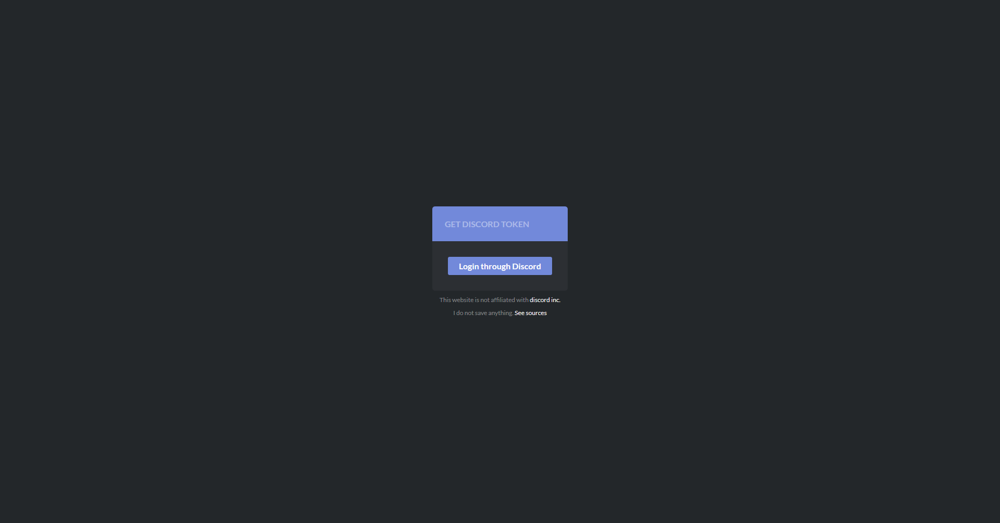
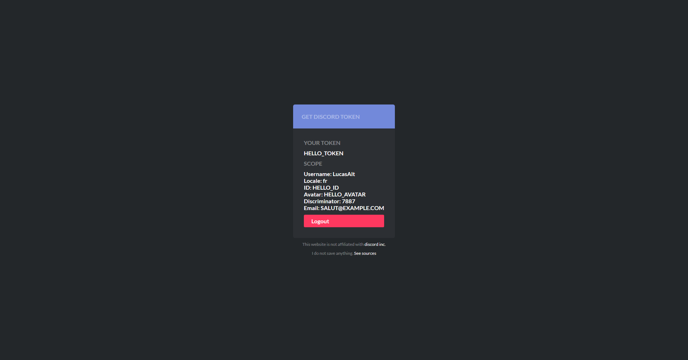

# discord_oauth_expressjs

Based on this tutorial [https://medium.com/@orels1/using-discord-oau...](https://medium.com/@orels1/using-discord-oauth2-a-simple-guide-and-an-example-nodejs-app-71a9e032770)
